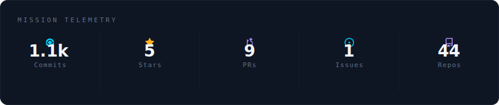

I am a backend developer focused on building scalable APIs, robust integrations, and performance-driven systems. I have solid experience with PHP, Laravel, and the .NET ecosystem, working on solutions that solve real business problems with simplicity and efficiency. My goal is to develop reliable software that is easy to evolve and prepared for continuous growth.

  

 

  

 

  

 

  

