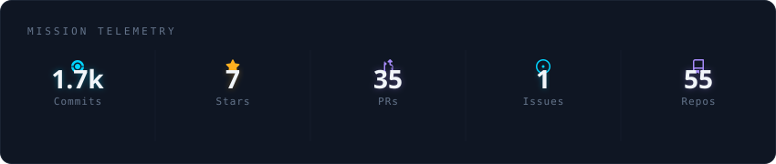

<h1 align="center">Olá! 👋 Bem-vindo ao meu GitHub!</h1>

  Sou desenvolvedor backend focado na construção de APIs escaláveis, integrações robustas e sistemas orientados a desempenho. Tenho sólida experiência com PHP, Laravel, Python e o ecossistema .NET, trabalhando em soluções que resolvem problemas reais de negócio com simplicidade e eficiência. Meu objetivo é desenvolver softwares confiáveis, fáceis de evoluir e preparados para um crescimento contínuo.

 

  

 

  

 

  

 

<h2>⚡ Sobre mim:</h2>
<ul>
  <li><strong>Desenvolvedor Full Stack.</strong></li>
  <li>Apaixonado por tecnologia e inovação, estou sempre buscando aprender coisas novas e enfrentar novos desafios.</li>
</ul>

<h2>🛠️ Tecnologias e ferramentas que utilizo:</h2>
<ul>
  <li>PHP, Laravel, .NET, C#, Python, Node.js</li>
  <li>Angular, TypeScript, Livewire, jQuery, JavaScript, Tailwind, Bootstrap, HTML, CSS</li>
  <li>PostgreSQL, MySQL, MongoDB, Redis, SQLite</li>
  <li>AWS, S3, Git, Docker, Nginx, Apache2</li>  
</ul>

<h2>🚀 Alguns projetos em que trabalhei:</h2>
<ul>
  <li><a href="https://fligpix.com.br/"><strong>Fligpix</strong></a>: Sistema de gestão financeira integrado a múltiplos gateways, permitindo a personalização de transações específicas.</li>

  <li><a href="https://xsa-manager.officecom.app"><strong>XSA Manager</strong></a>: Ferramenta de gerenciamento para casas de apostas. Permite criação, bloqueio e gerenciamento de pagamentos de assinantes.</li>

  <li><a href="https://solarmaker.com.br"><strong>Solarmaker</strong></a>: Plataforma de gerenciamento de sistemas solares integrada a sistemas embarcados de inversores.</li>

  <li><a href="https://app.localizadordeeditais.com.br"><strong>Localizador de Editais</strong></a>: Ferramenta de busca e catalogação de editais governamentais integrada a três APIs do Governo Federal.</li>

  <li><a href="http://app.andradeengenhariaeletrica.com.br/"><strong>Andrade Engenharia</strong></a>: CRM desenvolvido para uma empresa de engenharia, integrado à plataforma Granatum.</li>
</ul>

<h2>🌱 O que estou aprendendo:</h2>

Atualmente, estou aprimorando meus conhecimentos em .NET, com foco em arquitetura de microsserviços.

<h2>💬 Vamos conversar?</h2>

Se você deseja colaborar em algum projeto ou simplesmente trocar ideias, fique à vontade para entrar em contato! Gosto de discutir novas ideias, tecnologias e resolver desafios de programação.

 

 
  

   

   

